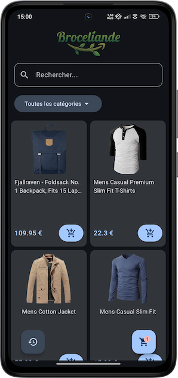
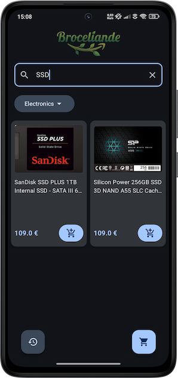
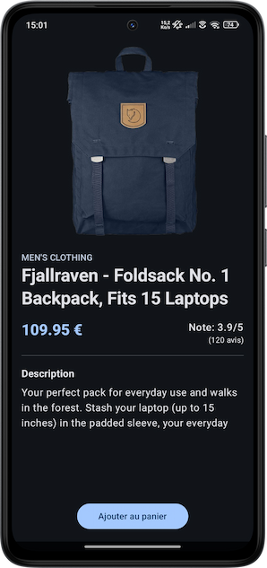
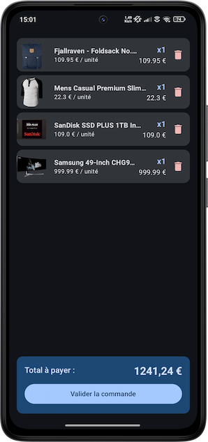
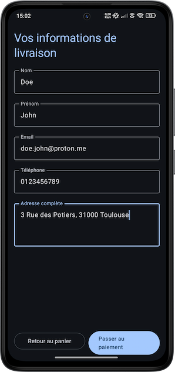
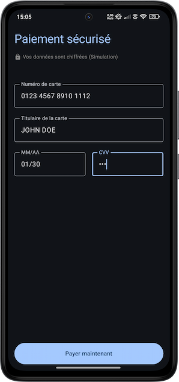
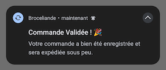
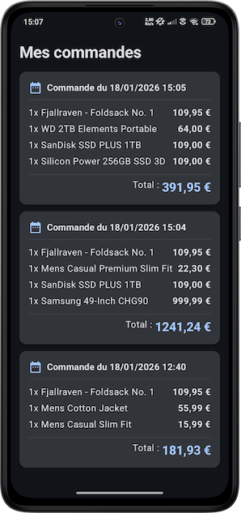

# Brocéliande 🌲🛒

Brocéliande est une application Android de e-commerce développée en Kotlin et Jetpack Compose.
Elle permet aux utilisateurs de parcourir un catalogue de produits, de gérer un panier,
de simuler un processus de commande complet et de consulter l'historique de leurs achats.

**[Télécharger maintenant ⏬](broceliande-app.apk)**

## 📱 Fonctionnalités

L'application couvre l'ensemble du parcours utilisateur d'un site de e-commerce classique :

### Navigation et recherche *(la page d'accueil)*

- **Catalogue de produits :** Affichage des produits sous forme de grille avec image, titre et prix.
- **Recherche :** Barre de recherche dynamique pour filtrer les produits par nom.
- **Filtrage par catégorie :** Menu déroulant pour filtrer les produits par catégories récupérées
depuis l'API.
- **Indicateur de panier :** Badge sur le bouton du panier indiquant le nombre d'articles.





### Détails du produit *(la page affichée au clique d'un produit)*

- **Affichage complet des informations :** Image haute résolution, description, catégories, prix et
note sur 5 avec le nombre d'avis.
- **Ajout au panier :** Présence du bouton pour ajouter l'article au panier avec le feedback visuel
(toast)



### Gestion du panier

- **Visualisation :** Récapitulatif des articles ajoutés avec leur quantité et prix unitaire.
- **Suppression :** Possibilité de retirer un ou plusieurs articles du panier.



### Processus de commande

- **Formulaire :** Saisie des informations client (Nom, Prénom, Email, Téléphone, Adresse).
- **Paiement sécurisé (simulation) :** Saisie des coordonnées bancaires avec formatage automatique,
simulation d'un petit délai de traitement réseau, puis validation visuelle et redirection vers
l'accueil après succès.
- **Notification :** Envoi d'une notification locale confirmant la validation de la commande.








### Historique

- **Consultation :** Liste des commandes passées (celles ayant eu un paiement validé).
- **Détail de chaque commande :** Date, liste des produits achetés et prix total.



## 🛠️ Implémentation technique

Le projet respecte les standards modernes du développement Android :

### Architecture

- **MVVM (Model-View-ViewModel) :** Séparation de la logique métier *(ViewModel)*, de l'interface *(Compose)*
et des données *(Repository/DAO)*.
- **Gestion réactive :** Utilisation de `StateFlow` et `MutableState` pour l'état de l'UI.

### Stack technologique

- **Interface utilisateur :** Jetpack Compose (Material Design 3) -> Utilisation de `Scaffold`,
`LazyVerticalGrid`, `LazyColumn` et composants Material pour une UI responsive et fluide.
- **Navigation :** Basée sur les `Intents` entre différentes activités (les écrans) -> `MainActivity`
, `ProductDetailsActivity` , `CartActivity` , `CommandActivity` , `PaiementActivity` et `OrderHistoryActivity`.
- **Asynchronisme :** Coroutines et Flow pour les opérations non-bloquantes (DB, requêtes réseau).

### Gestion des données

**Données distantes (API REST)**

- **Retrofit :** Client HTTP pour communiquer avec l'API.
- **Gson :** Convertisseur JSON vers objets Kotlin.
- **Source :** Les données proviennent de FakeStoreAPI *([lien vers leur doc](https://fakestoreapi.com/docs))*.
- **Images :** Librairie Coil pour le chargement des images dans l'application.

**Persistence locale**

- **Room Database :** Base de données SQLite abstraite pour stocker le panier en cours (`CartItem`)
ainsi que l'historique des commandes (`Order`, `OrderItem`).
- **DAO :** Objet d'accès aux données pour les requêtes SQL (`CartDao`, `OrderDao`).

### Fonctionnalités spécifiques implémentées

- **Notifications :** Utilisation du `NotificationChannel` et `NotificationCompat` pour notifier
l'utilisateur hors de l'application concernant la confirmation de sa commande.
- **Visual Transformation :** Implémentation de transformations personnalisées pour les champs de
saisie de carte bancaire (formatage `XXXX XXXX...` et date `MM/AA`).

## 📂 Structure du projet

```
I5RIOC.unilasalle.broceliande
├── data/               # Couche de données (Room Database, DAO)
├── model/              # Modèles de données (Product, Order, CartItem) et ViewModel
├── network/            # Configuration Retrofit et interface API
├── ui/theme/           # Thème Jetpack Compose (Couleurs, Typographie) [généré par défaut]
├── utils/              # Utilitaires (ici seulement le ToastHelper)
├── MainActivity.kt     # Ecran d'accueil (liste articles)
├── ProductDetails...   # Ecran de détails produit
├── CartActivity.kt     # Ecran du panier
├── CommandActivity.kt  # Ecran du formulaire de commande
├── PaiementActivity.kt # Ecran de la simulation de paiement
└── OrderHistory...     # Ecran de l'historique des commandes
```